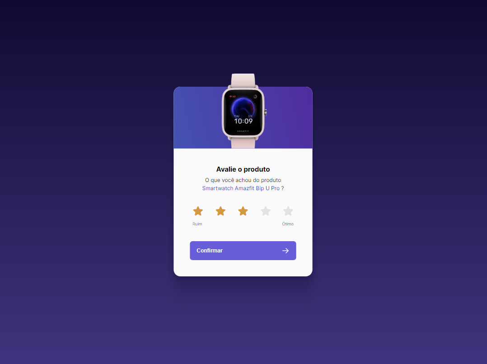
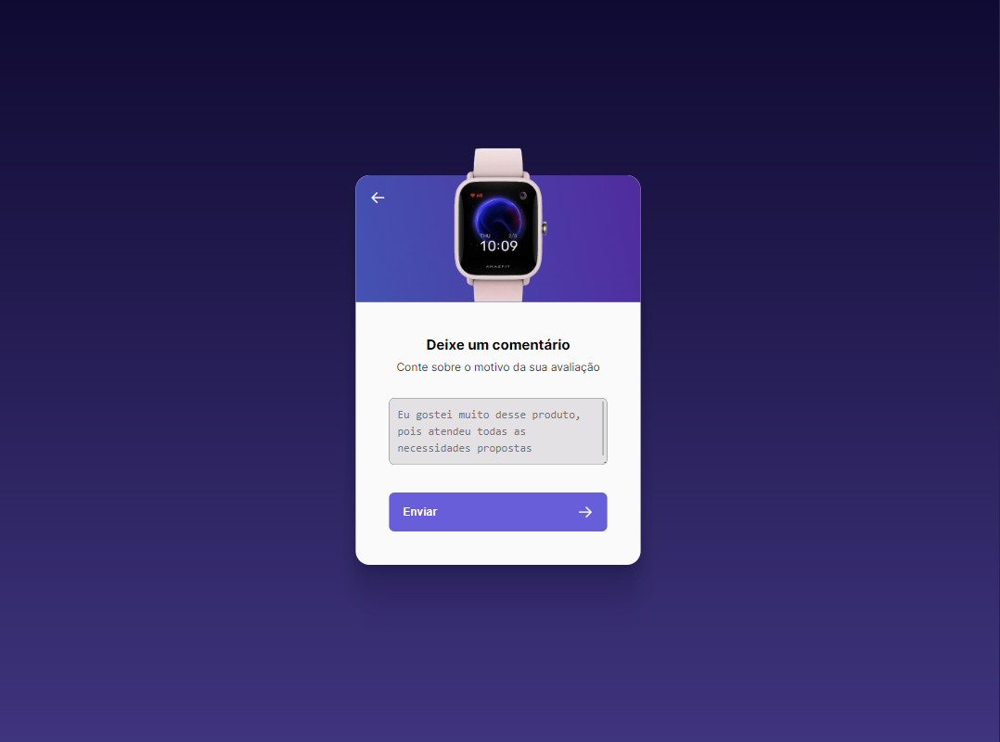

# BoraCodar - Desafio 39

## Avaliação de produto

O desafio foi de um componente de avaliação de produto, onde possuiria 2 telas:

### TELA 1

 A primeira tela possui a funcionalidade de avaliação por estrelas, onde possuiria estilos e cores diferente antes e depois de selecionar.  
 Esta tela também possui o botão de confirmar, onde é necessário ter feito a avaliação para prosseguir até a tela seguinte.

### TELA 2

A segunda tela segue o mesmo propósito visual, alterando somente as funcionalidades.  
 Seriam essas a opção da pessoa retornar a tela 1 através da seta na parte superior do card, a opção da pessoa deixar um comentário e por ultimo um botão para confirmar e enviar a avaliação.

